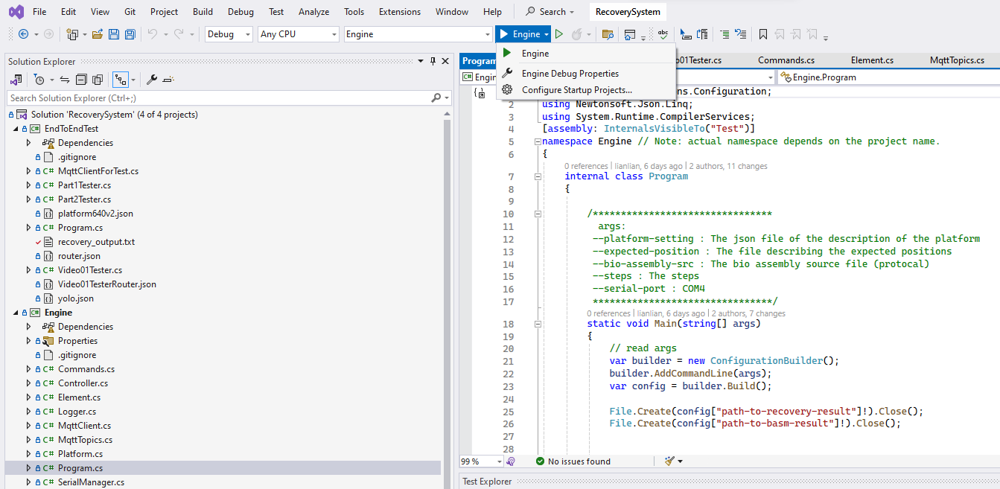

# DMF Recovery System

This is an AI-based real-time recovery system for digital microfluidic biochips under the development of DTU compute.

Digital microfluidic biochips are widely applied devices that manipulate micro-liter-sized liquid samples on an  electrode-covered planar surface, based on the electro-wetting-on-dielectric principle. Despite their growing rominence, DMF systems face reliability issues such as missing-movement events and the formation of gas bubbles. This thesis proposes a real-time recovery system based on artificial intelligence to address missing-movement events. The system employs the YOLOv5 detector to detect droplets and bubbles and determine their locations and sizes from camera feed. Once stuck droplets are detected, the system promptly recovers them. The proposed system enhances the reliability of DMF systems without additional hardware investments or onerous computational burdens. This technology has the potential to significantly improve the performance of DMF systems, enabling chemists and biologists to carry out more complex protocols within DMF systems.

# How to Run

## Requisite

* Python >= 3.11.7 (Not tested in older version)
* Dotnet >= 6.0.417 (Not tested before)
* Visual studio >= 2022 （Not tested in previous version)
* Your own MQTT Broker (Anyone you like is okay, but we use Mosquito here)
* Clone this code :)

## Install and run MQTT-Mosquito

* Download and install it here: [Mosquito](https://mosquitto.org/download/)
* Go to the folder where you install mosquito (or add it to your environment path)
* Run Mosquito broker
* You can test by subscribing to the channel `yolo/det`

```powershell
# Yolo v5 will publish detection results to this channel
 .\mosquitto_sub.exe -h localhost -t yolo/det
```

## Install and run AI-based-detector （YOLO v5）

> Part of the code here is based on [Yolov5](https://github.com/ultralytics/yolov5). Now they are improving their code everyday, but our model is trained on an version on 2022. To avoid inducing conflict when you pulling latest code by mistake, we don't use the git submodule.

```powershell


# cd .\dmf_recovery_system\yolov5\

# It is always a good idea to update your pip in advance
pip install -r .\requirements.txt

# Run the detecter
# python ./detect.py --weights .\runs\train\new-model-integrated-rgb\weights\best.pt --source 0
python detect.py --weight {path of your trained weight}    --source 0  # webcam  
                            										img.jpg  # image
                            										vid.mp4  # video
                            										path/  # directory
                            										path/*.jpg  # glob
                            				'https://youtu.be/Zgi9g1ksQHc'  # YouTube
                            'rtsp://example.com/media.mp4'  # RTSP, RTMP, HTTP stream


# example:
python ./detect.py --weights .\runs\train\new-model-integrated-rgb\weights\best.pt --source ..\image_dataset\CorrectionTest\   --require-preprocess
```

## Run Recovery System

Our Recovery System is based on dotnet.
Hence ensure you have installed correct version dotnet.

### Run with webcam
If you have a real connected camera, follow these instructions to run:

* Install all the required package for python

```shell
cd yolov5
pip install -r .\requirements.txt
```

* Open `RecoverySystem.sln`
``` shell
# under the root folder of the project
./RecoverySystem.sln
```

* Run Engine first



* Run Yolo V5 (--source 0 means choose your local webcam)

  ```shell
   py ./detect.py --weights .\runs\train\new-model-integrated-rgb\weights\best.pt --source 0 --require-preprocess
  ```

### Run with Live Stream

Sometimes dmf platform is not available. Although YoloV5 supports read video and images, but  it will read video frame by frame. It cannot simulate the real scenario with camera. Hence we recommend to run with live stream.

* Install : 

  * [node-media-server - npm (npmjs.com)](https://www.npmjs.com/package/node-media-server) Install this media server to push your stream
  * [FFmpeg](https://ffmpeg.org/)  This tool could stream your local video 

* Run `node-media-server`

  ```shell
  node-media-server
  ```

* Run `ffmpeg` with recursive mode (keep pushing the video)

  ```shell
   .\ffmpeg.exe -re -stream_loop -1 -i  C:\DevProj\dmf_recovery_system\Cases\WIN_20240112_18_57_12_Pro.mp4 -c:v libx264 -preset veryfast -tune zerolatency -c:a aac -ar 44100 -f flv rtmp://localhost/live/yolo
  ```

* Run `yolo v5` to detect the live stream

  ```shell
  cd .\yolov5
  
  py ./detect.py --weights .\runs\train\new-model-integrated-rgb\weights\best.pt --source rtmp://localhost/live/yolo  --require-preprocess
  ```

* Then execute `Engine` in `RecoverySystem.sln` again.

### Run Tests

We have several unit tests in Project `Test`. Don't forget to execute them to verify your changes. 


🔗 Link to videos that demonstrate functional tests on detection and recovery parts: https://github.com/JiananAlvin/image_bed/tree/master/images/BachelorThesis
